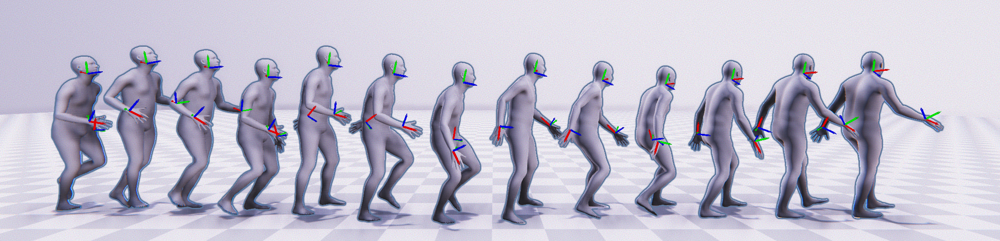

# AGRoL: Generating Smooth Human Motion from Sparse Tracking Inputs with Diffusion Model

> [**Avatars Grow Legs: Generating Smooth Human Motion from Sparse Tracking Inputs with Diffusion Model**](https://dulucas.github.io/agrol/)
> [Y. Du](https://dulucas.github.io/), [R. Kips](https://scholar.google.fr/citations?user=RwyrWEkAAAAJ&hl=en), A. [Pumarola](https://www.albertpumarola.com/), [S. Starke](https://www.sebastianxstarke.com/), [A. Thabet](https://scholar.google.com/citations?user=7T0CPEkAAAAJ&hl=en), [A. Sanakoyeu](https://gdude.de/)
> CVPR 2023

[[`arXiv`](https://arxiv.org/abs/2304.08577)] [[`Project`](https://dulucas.github.io/agrol/)] [[`BibTeX`](#-citing-agrol)]

<p align="center">  </p>

## Enviroment Setup
All our experiments are done on a single V-100 16G GPU.
```
conda env create -f environment.yml
conda activate agrol
```
The code was tested on Python 3.9 and PyTorch 1.12.1.

Download the [human_body_prior](https://github.com/nghorbani/human_body_prior/tree/master/src) lib and [body_visualizer](https://github.com/nghorbani/body_visualizer/tree/master/src) lib and put them in this repo. The repo should look like
```
agrol
├── body_visualizer
├──── mesh/
├──── tools/
├──── ...
├── human_body_prior/
├──── body_model/
├──── data/
├──── ...
├── dataset/
├── prepare_data/
└── ...
```

## Dataset Preparation
Please download the AMASS dataset from [here](https://amass.is.tue.mpg.de/)(SMPL+H G).
```
python prepare_data.py --support_dir /path/to/your/smplh/dmpls --save_dir ./dataset/AMASS/ --root_dir /path/to/your/amass/dataset
```
The generated dataset should look like this
```
./dataset/AMASS/
├── BioMotionLab_NTroje
├──── train/
├──── test/
├── CMU/
├──── train/
├──── test/
└── MPI_HDM05/
├──── train/
└──── test/
```

## Evaluation
You can either download our pre-trained models or use your pre-trained model.
To download our pre-trained models:
```
sh prepare_data/download_model.sh
```

To evaluate the model:
```
# Diffusion model
python test.py --model_path /path/to/your/model --timestep_respacing ddim5 --support_dir /path/to/your/smpls/dmpls --dataset_path ./dataset/AMASS/

# MLP
python test.py --model_path /path/to/your/model --support_dir /path/to/your/smpls/dmpls --dataset_path ./dataset/AMASS/
```

## Training
To train the AGRoL diffusion-model:
```
python train.py --save_dir /path/to/save/your/model --dataset amass --weight_decay 1e-4 --batch_size 256 --lr 3e-4 --latent_dim 512 --save_interval 1 --log_interval 1 --device 0 --input_motion_length 196 --diffusion_steps 1000 --num_workers 8 --motion_nfeat 132 --arch diffusion_DiffMLP --layers 12 --sparse_dim 54 --train_dataset_repeat_times 1000 --lr_anneal_steps 225000 --overwrite
```
To train the MLP model:
```
python train.py --save_dir /path/to/save/your/model --dataset amass --weight_decay 1e-4 --batch_size 256 --lr 3e-4 --latent_dim 512 --save_interval 1 --log_interval 1 --device 0 --input_motion_length 196 --diffusion_steps 1000 --num_workers 8 --motion_nfeat 132 --arch mlp_PureMLP --layers 12 --sparse_dim 54 --train_dataset_repeat_times 1000 --lr_anneal_steps 225000 --overwrite --no_normalization
```

## Pretrained Weights
The pretrained weights for AGRoL can be downloaded from this link: https://github.com/facebookresearch/AGRoL/releases/tag/v0

To download the wights automatically, please run `bash prepare_data/download_model.sh`.

To test the pretrained AGRoL diffusion-model:
```
python test.py --model_path pretrained_weights/diffmlp.pt --timestep_respacing ddim5 --support_dir /path/to/your/smpls/dmpls --dataset_path ./dataset/AMASS/
```

## License
![CC BY-NC 4.0][cc-by-nc-shield]

The majority of AGRoL code is licensed under CC-BY-NC, however portions of the project are available under separate license terms:
- Trimesh, [AvatarPose](https://github.com/eth-siplab/AvatarPoser), [Guided Diffusion](https://github.com/openai/guided-diffusion), and [MDM](https://github.com/GuyTevet/motion-diffusion-model) are licensed under the MIT license;
- Human Body Prior is licensed under a custom license for non-commercial scientific research purposes, available at [link](https://github.com/nghorbani/human_body_prior/blob/master/LICENSE);
- Body Visualizer is licensed under a custom license for non-commercial scientific research purposes, available at [link](https://github.com/nghorbani/body_visualizer/blob/master/LICENSE).

[cc-by-nc-shield]: https://img.shields.io/badge/License-CC%20BY--NC%204.0-lightgrey.svg

## <a name="CitingAGRoL"></a> Citing AGRoL
If you find our work inspiring or use our codebase in your research, please consider giving a star ⭐ and a citation.

```BibTeX
@inproceedings{du2023agrol,
  author    = {Du, Yuming and Kips, Robin and Pumarola, Albert and Starke, Sebastian and Thabet, Ali and Sanakoyeu, Artsiom},
  title     = {Avatars Grow Legs: Generating Smooth Human Motion from Sparse Tracking Inputs with Diffusion Model},
  booktitle = {CVPR},
  year      = {2023},
}
```
